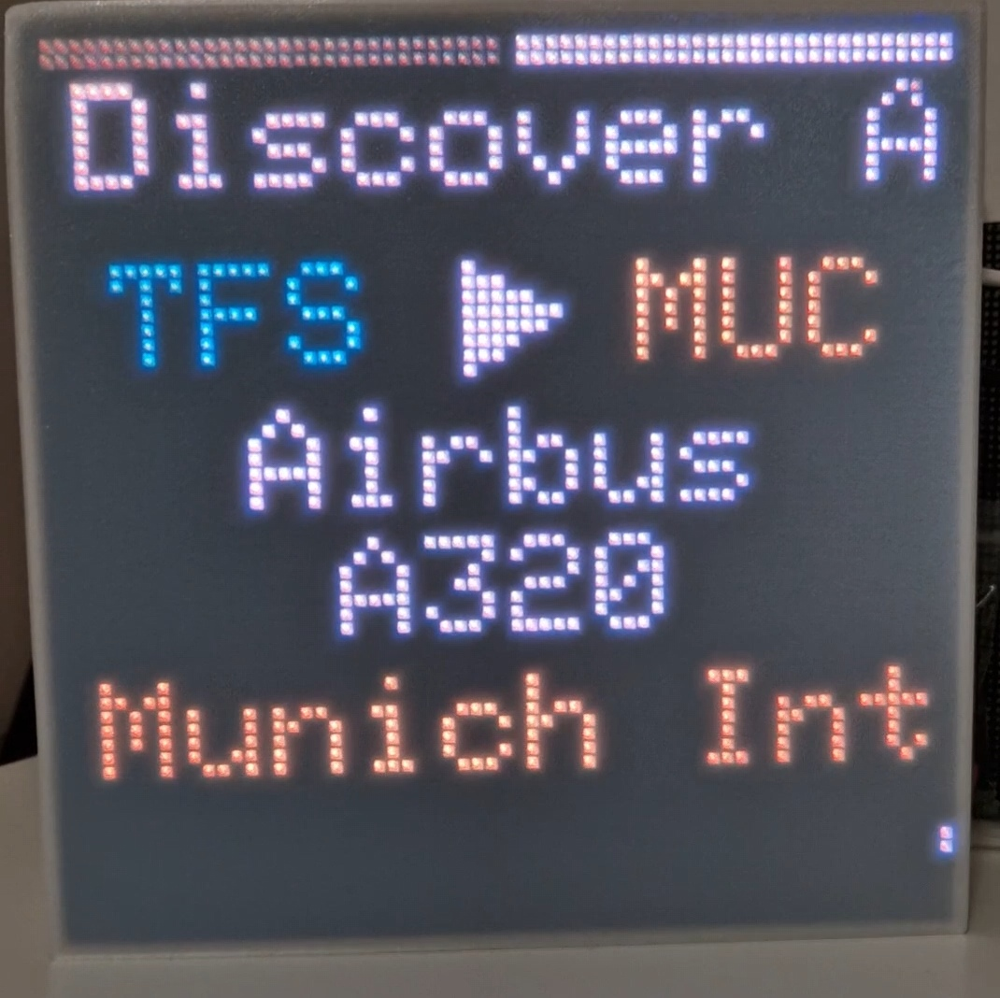
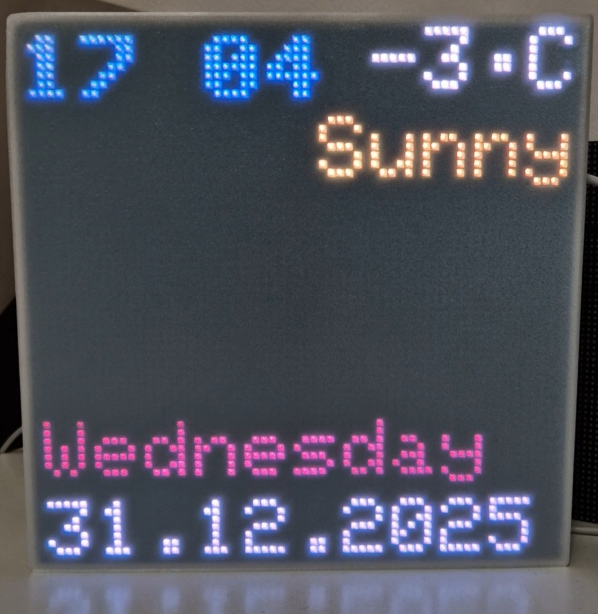

# FlightWatch

FlightWatch is based on the opensource TheFlightWall_OSS project by AxisNimble. FlightWatch is tuned for an ESP32 Trinity driving a single 64x64 HUB75 RGB panel. The firmware prioritizes low RAM usage (single-buffer display, streaming parses, static TLS clients, short-lived portal) while fetching nearby flights.

## Hardware (current build)
- ESP32 Trinity (HUB75 output)
- 64x64 HUB75 RGB matrix (single panel)
- 5V power matched to your panel; follow Trinity pinout in `config/HardwareConfiguration.h`
- Optional: 3D-printed bracket/enclosure for the single panel

## Data sources
- OpenSky (OAuth) for ADS-B state vectors (`states/all`)
- FlightAware AeroAPI for route/airline/aircraft enrichment (filtered, cached)
- Embedded airline/aircraft lookup tables (no CDN)

## Firmware behavior
- Fetch cadence: `TimingConfiguration::FETCH_INTERVAL_SECONDS` (default 30s)
- OpenSky: static TLS client, streaming JSON parse, heap guard (skips if heap is low), 2-minute TLS backoff after failure
- AeroAPI: static TLS client, stream parse with filter, per-pass limit (2 calls), 20s TLS backoff, 60s enrichment cache
- Weather: idle-only, plain HTTP (no TLS), short backoff; clears stale symbol if weather code is missing
- Portal: `flightwatch.local` available for 10 seconds after boot; shuts down if unused to free MDNS/HTTP resources
- Display: single-buffered HUB75 (double buffer disabled to save RAM); slight tearing possible; scroll/tick rate adjustable in `NeoMatrixDisplay`

## Setup
1) WiFi: Captive portal via WiFiManager; defaults in `config/WiFiConfiguration.h`
2) Location/display: Set in `config/UserConfiguration.h` (center lat/lon, radius, units, colors, brightness)
3) Hardware: HUB75 pin/size in `config/HardwareConfiguration.h`
4) API keys: `config/APIConfiguration.h` (OpenSky OAuth client_id/secret, AeroAPI key)
5) Lookup tables: edit `tools/airlines.json` / `tools/aircraft.json`, then regenerate:
python tools/generate_lookup_header.py --airlines tools/airlines.json --aircraft tools/aircraft.json --out core/LookupTables.generated.h

## Build & flash
- PlatformIO project (`platformio.ini`); ensure `utils/*.cpp` is included (NetLock)
- Open the `firmware` folder in VS Code with the PlatformIO extension
- Click Upload to flash the ESP32 Trinity

## Notes on memory/TLS
- Single-buffer display frees heap for TLS; streaming parses avoid large payload buffers
- If TLS failures persist, options: lengthen fetch interval, lower per-pass AeroAPI limit, or re-enable double-buffer only if RAM allows (at the cost of more heap)

## Thanks
This project is my first attempt to make an open source contribution dedicated for aviation enthusiasts(count me in!). Pardon me if I have made some mistakes here and there.
Special thanks to,
- ADS-B contributors for making flight data available
- Brian Lough for developing the ESP32 Trinity board
and to many more who developed so many useful libraries without that this project couldn't be in this shape. Third-party notices available in firmware\Notice.txt

<small>

### Disclaimer, Data Sources & Intended Use

- FlightWatch is provided for personal, private, and educational use only
- Distributed on an “AS IS” BASIS, WITHOUT WARRANTIES OR CONDITIONS OF ANY KIND, as defined by the Apache License, Version 2.0
- Uses third-party data services:
    OpenSky API (ADS-B state vectors)
    FlightAware AeroAPI (flight, route, and aircraft enrichment)
- Users must supply and use their own personal/private account credentials (OpenSky OAuth client_id/secret, AeroAPI key)
- Third-party services are not provided, proxied, or managed by FlightWatch and remain subject to their respective terms of service

### Data Accuracy & Limitations

- Flight positions, routes, and metadata are sourced from third parties and may be inaccurate, delayed, incomplete, filtered, or unavailable
- No guarantees are made regarding accuracy, completeness, reliability, or timeliness
- Displayed data must not be relied upon for real-world decision-making

### Non-Intended and Prohibited Use

- Not certified, approved, or intended for:
    - Navigation or navigational decision-making
    - Air traffic control or surveillance
    - Safety-critical, regulated, or life-critical systems
    - Commercial, operational, or enterprise monitoring

- Must never be used for aviation safety, regulatory compliance, or commercial purposes

### Limitation of Liability

To the maximum extent permitted by law, the authors and contributors disclaim all liability for any damages arising from the use, misuse, or inability to use this software, associated hardware designs, or any third-party data accessed or displayed

</small>
